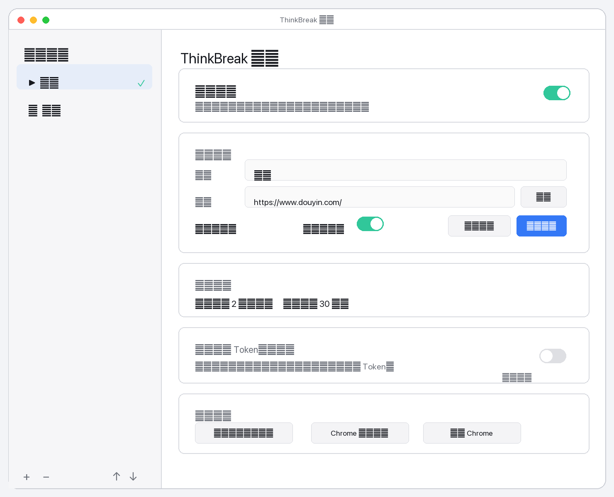
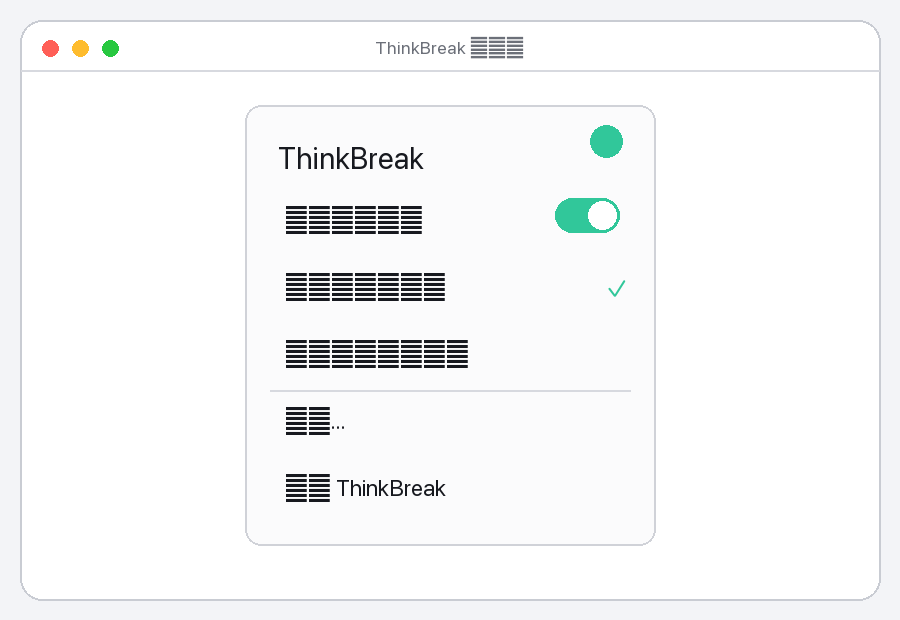
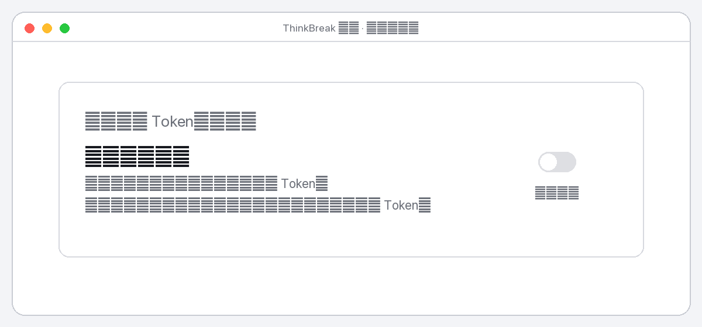
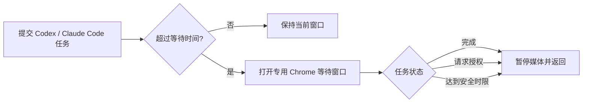

<div align="center">
  
  <h1>ThinkBreak</h1>
  <p>AI 在思考，你先休息一下。</p>
  <p><strong>Codex / Claude Code 的 macOS 等待内容切换器</strong></p>
  <p><a href="README.en.md">English</a> · 简体中文</p>
</div>

> [!WARNING]
> `v0.1.0` 是未经 Apple 公证的测试版，使用 ad-hoc 签名。请先阅读下方的首次打开和权限说明。

ThinkBreak 是一个开源的 macOS 菜单栏应用。你向 Codex 或 Claude Code 提交任务后，如果任务持续超过默认的 2 秒，它会打开你选好的网页；任务完成或请求授权时，它会暂停网页媒体，并把焦点还给原来的窗口。

你可以把等待内容设成抖音、小说、文章或任何普通网页。每个预设保留自己的 Chrome 标签页，因此登录状态、推荐流和阅读位置都可以继续使用。



## 功能

- **总开关**：在菜单栏和设置窗口中随时启用或停用自动切换。
- **可替换内容预设**：新增、编辑、删除、排序并选择当前网页。
- **媒体模式**：进入时尝试恢复当前可见媒体，离开时暂停页面中的视频和音频。
- **阅读模式**：只打开和切回，不修改网页状态。
- **短任务防闪屏**：默认等待 2 秒；任务很快完成时不会切走。
- **准确返回**：任务结束或请求授权时回到启动任务的 Codex / 终端窗口。
- **多任务保护**：最新任务拥有前台控制权，旧任务结束不会抢走焦点。
- **本地优先**：网址、窗口状态和任务标识只保存在本机，无遥测、无分析 SDK。

### 菜单栏



### “看广告换 Token”

这是一个来自社区讨论的玩梗功能区：传说可以“看广告换 Token”。`v0.1.0` 中开关固定为禁用状态，不显示广告、不连接账户、不追踪用户，也不会增加或修改任何真实 Token。



## 工作流程



## 系统要求

- macOS 14 Sonoma 或更高版本
- Google Chrome
- Codex App / Codex CLI，和/或 Claude Code
- 首次设置时授予 macOS **辅助功能** 权限
- 如需自动播放/暂停网页媒体，开启 Chrome 的 **Allow JavaScript from Apple Events**

目前只正式支持 macOS、Google Chrome、Codex App 和终端中的 Claude Code。

## 快速安装

### 方式一：下载测试版

1. 在 GitHub Releases 下载 `ThinkBreak-0.1.0-macos.zip` 和对应的 `.sha256` 文件。
2. 可选：验证下载文件：

   ```bash
   shasum -a 256 -c ThinkBreak-0.1.0-macos.zip.sha256
   ```

3. 解压后打开终端，进入解压目录并运行：

   ```bash
   ./scripts/install-release.sh
   ```

安装器会把应用放到 `~/Applications/ThinkBreak.app`，把轻量 hook 命令放到 `~/.local/bin/thinkbreak-hook`，并为当前可用的 Codex / Claude Code 安装插件。

### 方式二：从源码构建

需要 Xcode Command Line Tools 和 Swift 6：

```bash
git clone https://github.com/Tx0Zero/ThinkBreak.git
cd ThinkBreak
./scripts/install-all.sh
```

也可以单独安装：

```bash
./scripts/install-app.sh
./scripts/install-codex-plugin.sh
./scripts/install-claude-plugin.sh
```

Claude Code 安装器优先使用 `PATH` 中的官方 `claude` 命令，并兼容常见 npm 全局安装位置。特殊环境可设置 `CLAUDE_CLI=/path/to/claude`。

## 首次打开与权限

### 1. 打开未公证测试版

当前下载版没有 Apple Developer ID 签名和公证。如果 macOS 阻止打开：

1. 在 Finder 打开 `~/Applications`。
2. 按住 Control 点击 `ThinkBreak.app`，选择“打开”。
3. 在系统提示中再次选择“打开”。

如果仍被隔离属性阻止，可以在确认下载来源后运行：

```bash
xattr -dr com.apple.quarantine ~/Applications/ThinkBreak.app
open ~/Applications/ThinkBreak.app
```

### 2. 辅助功能权限

进入 **系统设置 → 隐私与安全性 → 辅助功能**，允许 ThinkBreak 控制电脑。此权限用于记录并恢复原来的应用、窗口和输入焦点；没有权限时 hooks 仍会立即退出，不会阻塞 Codex 或 Claude Code，但窗口恢复可能不准确。

设置窗口中的“授予辅助功能权限”按钮可以直接触发系统提示。

### 3. Chrome Apple Events JavaScript

在 Chrome 菜单中打开：

**View → Developer → Allow JavaScript from Apple Events**<br>
**显示 → 开发者 → 允许来自 Apple 事件的 JavaScript**

此选项只用于恢复/暂停当前网页中的媒体。未开启时，ThinkBreak 仍可打开和切换 Chrome，但无法可靠地控制视频或音频。可在设置窗口点击“测试 Chrome”检查。

## 使用

1. 点击菜单栏中的 ThinkBreak 图标。
2. 确认“启用自动切换”已打开。
3. 打开“设置…”，编辑默认预设或添加新网页。
4. 为预设选择：
   - `媒体`：适合视频和音频网站。
   - `阅读`：适合小说、文章和文档。
5. 选择当前等待内容，然后照常向 Codex 或 Claude Code 提交任务。

每个预设会复用自己的标签页。手动关闭标签页后，下次使用会重新创建。

## 更新

源码安装：

```bash
git pull
./scripts/install-all.sh
```

下载版：下载新版本并再次运行其中的 `./scripts/install-release.sh`。重复安装会替换应用和 hook，但保留 `~/Library/Application Support/ThinkBreak/` 中的设置。

## 卸载

在源码目录或下载包中运行：

```bash
./scripts/uninstall.sh
```

默认保留本地设置。彻底删除配置：

```bash
./scripts/uninstall.sh --purge-data
```

卸载脚本不会修改 Chrome 用户数据、浏览记录、登录状态或普通标签页。

## 隐私

ThinkBreak 不包含遥测、统计、广告 SDK 或远程后端。以下数据仅保存在你的 Mac：

- 自定义内容预设及网址
- 当前选择、开关、延迟和安全时限
- 任务运行期间用于恢复焦点的临时窗口标识

hook 不发送任务正文。项目不会上传网址、浏览记录、任务信息或账户数据。

## 产品边界与限制

ThinkBreak `v0.1.0`：

- 不会自动上下刷视频；滚动和选片由用户操作。
- 不会点赞、评论、关注、分享或执行网站账号操作。
- 不提供广告投放、广告素材、追踪或真实 Token 奖励。
- 不保证所有网站都允许脚本恢复媒体；浏览器自动播放策略仍然生效。
- 不支持 Safari、Firefox、Windows 或 Linux。
- 下载版未经 Apple 公证，适合测试，不是正式签名发行版。

## 常见问题

<details>
<summary><strong>任务开始后没有切换窗口</strong></summary>

确认总开关已开启、当前预设已启用、任务超过等待时间，并检查 ThinkBreak 是否正在菜单栏运行。hook 未安装时可重新执行对应安装脚本。
</details>

<details>
<summary><strong>能打开网页，但结束时视频没有暂停</strong></summary>

检查 Chrome 的 “Allow JavaScript from Apple Events” 是否开启，然后在 ThinkBreak 设置中点击“测试 Chrome”。部分网站或跨域播放器可能限制脚本控制。
</details>

<details>
<summary><strong>返回了错误的窗口</strong></summary>

在系统辅助功能设置中重新允许 ThinkBreak，然后退出并重开应用。若同时运行多个任务，普通完成事件只会让当前拥有前台控制权的任务返回；授权请求会优先返回对应任务。
</details>

<details>
<summary><strong>必须同时安装 Codex 和 Claude Code 吗？</strong></summary>

不需要。可以只运行对应的插件安装脚本。统一安装器在找不到某个 CLI 时会给出提示。
</details>

## 开发与测试

```bash
./scripts/validate.sh
./scripts/package-release.sh
```

核心测试目前包含 18 项行为检查。完整验证还包括 Debug/Release 构建、shell 语法、版本一致性、插件清单、Info.plist 和 ad-hoc codesign。发布前请执行 [`docs/RELEASE_CHECKLIST.md`](docs/RELEASE_CHECKLIST.md)。

贡献前请阅读 [`CONTRIBUTING.md`](CONTRIBUTING.md)。安全问题请按 [`SECURITY.md`](SECURITY.md) 私下报告。

## 开源协议

[MIT License](LICENSE) © TX0Zero Studio

## 免责声明

ThinkBreak 是独立的开源社区项目，与 OpenAI、Anthropic、Google、Google Chrome、抖音或其关联公司没有官方隶属、授权、赞助或背书关系。Codex、Claude、Chrome、Google 和抖音等名称及商标归各自权利人所有。
